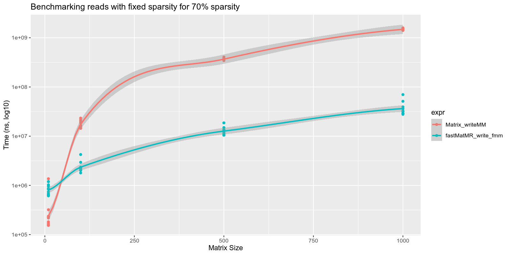

## Introduction

This vignette demonstrates a benchmark comparing the `writeMM` function from the
`Matrix` package against the `write_fmm` function from the `fastMatMR` package.
Since `Matrix` does not support reading or writing dense matrices, we focus on
the sparse case.

## Loading Packages

First, we load the necessary packages:


```r
library(Matrix)
library(fastMatMR)
library(microbenchmark)
library(ggplot2)
```

## Benchmarking with Fixed Sparsity

We first benchmark for varying matrix sizes with fixed sparsity.


```r
# Function to create a sparse matrix of given size
create_sparse_matrix <- function(n, sparsity = 0.7) {
  mat <- matrix(0, nrow = n, ncol = n)
  for (i in 1:n) {
    for (j in 1:n) {
      if (runif(1) > sparsity) {
        mat[i, j] <- rnorm(1)
      }
    }
  }
  return(Matrix(mat, sparse = TRUE))
}

# Define a range of matrix sizes
sizes <- c(10, 100, 500, 1000)

# Prepare data frame to store results
results_fixed_sparsity <- data.frame()

# Benchmarking
for (n in sizes) {
  message("Benchmarking for matrix size: ", n, "x", n)

  # Generate a sparse matrix of size n x n
  testmat <- create_sparse_matrix(n)

  # Run the benchmarks
  bm <- microbenchmark(
    Matrix_writeMM = writeMM(testmat, "mat.mtx"),
    fastMatMR_write_fmm = write_fmm(testmat, "fmm.mtx"),
    times = 10
  )

  bm$size <- n
  results_fixed_sparsity <- rbind(results_fixed_sparsity, bm)
}
#> Benchmarking for matrix size: 10x10
#> Benchmarking for matrix size: 100x100
#> Benchmarking for matrix size: 500x500
#> Benchmarking for matrix size: 1000x1000
```

This is shown visually represented below:


```r
# Plotting
suppressWarnings(print(
  ggplot(results_fixed_sparsity, aes(x = size, y = time, color = expr)) +
    geom_point() +
    geom_smooth(method = "loess") +
    scale_y_log10() +
    ggtitle("Benchmarking writes with fixed sparsity for 70% sparsity") +
    xlab("Matrix Size") +
    ylab("Time (ns, log10)")
))
#> `geom_smooth()` using formula = 'y ~ x'
```

<div class="figure">

<p class="caption">plot of chunk fixed-sparse-write</p>
</div>

## Benchmarking with Varying Sparsity

Now, we benchmark for varying sparsity patterns on a large matrix.


```r
# Sparsity levels to test
sparsity_levels <- seq(0.4, 0.95, by = 0.05)

# Prepare data frame to store results
results_varying_sparsity <- data.frame()

# Benchmarking
for (sparsity in sparsity_levels) {
  message("Benchmarking for sparsity level: ", sparsity)

  # Generate a sparse matrix of size 500 x 500 with varying sparsity
  testmat <- create_sparse_matrix(500, sparsity)

  # Run the benchmarks
  bm <- microbenchmark(
    Matrix_writeMM = writeMM(testmat, "mat.mtx"),
    fastMatMR_write_fmm = write_fmm(testmat, "fmm.mtx"),
    times = 10
  )

  bm$sparsity <- sparsity
  results_varying_sparsity <- rbind(results_varying_sparsity, bm)
}
#> Benchmarking for sparsity level: 0.4
#> Benchmarking for sparsity level: 0.45
#> Benchmarking for sparsity level: 0.5
#> Benchmarking for sparsity level: 0.55
#> Benchmarking for sparsity level: 0.6
#> Benchmarking for sparsity level: 0.65
#> Benchmarking for sparsity level: 0.7
#> Benchmarking for sparsity level: 0.75
#> Benchmarking for sparsity level: 0.8
#> Benchmarking for sparsity level: 0.85
#> Benchmarking for sparsity level: 0.9
#> Benchmarking for sparsity level: 0.95
```

Now we can plot this:


```r
ggplot(results_varying_sparsity, aes(x = sparsity, y = time, color = expr)) +
  geom_point() +
  geom_smooth(method = "loess") +
  scale_x_log10() +
  scale_y_log10() +
  ggtitle("Benchmarking writes with varying sparsity for 500 entries") +
  xlab("Sparsity Level (log10)") +
  ylab("Time (ns, log10)")
#> `geom_smooth()` using formula = 'y ~ x'
```

<div class="figure">

<p class="caption">plot of chunk varying-sparse-write</p>
</div>

## Conclusions

Clearly, for larger matrices, and `fastMatMR` is consistently around two orders
of magnitude faster than `Matrix`. For extremely small matrices (<50) and at
high (~.7) levels of sparsity, the difference is not as pronounced, but for
matrices larger than 50x50 `fastMatMR` retains an order of magnitude
improvement.

## Session Info
This vignette was computed in advance, with the corresponding session info:


```r
sessionInfo()
#> R version 4.3.1 (2023-06-16)
#> Platform: x86_64-pc-linux-gnu (64-bit)
#> Running under: Arch Linux
#> 
#> Matrix products: default
#> BLAS:   /usr/lib/libblas.so.3.11.0 
#> LAPACK: /usr/lib/liblapack.so.3.11.0
#> 
#> locale:
#>  [1] LC_CTYPE=en_US.UTF-8       LC_NUMERIC=C              
#>  [3] LC_TIME=en_US.UTF-8        LC_COLLATE=en_US.UTF-8    
#>  [5] LC_MONETARY=en_US.UTF-8    LC_MESSAGES=en_US.UTF-8   
#>  [7] LC_PAPER=en_US.UTF-8       LC_NAME=C                 
#>  [9] LC_ADDRESS=C               LC_TELEPHONE=C            
#> [11] LC_MEASUREMENT=en_US.UTF-8 LC_IDENTIFICATION=C       
#> 
#> time zone: Iceland
#> tzcode source: system (glibc)
#> 
#> attached base packages:
#> [1] stats     graphics  grDevices utils     datasets  methods   base     
#> 
#> other attached packages:
#> [1] ggplot2_3.4.4         microbenchmark_1.4.10 Matrix_1.5-4.1       
#> [4] fastMatMR_1.2.5       testthat_3.1.10      
#> 
#> loaded via a namespace (and not attached):
#>  [1] gtable_0.3.4      xfun_0.40         htmlwidgets_1.6.2 devtools_2.4.5   
#>  [5] remotes_2.4.2.1   processx_3.8.2    lattice_0.21-8    callr_3.7.3      
#>  [9] generics_0.1.3    vctrs_0.6.3       tools_4.3.1       ps_1.7.5         
#> [13] parallel_4.3.1    tibble_3.2.1      fansi_1.0.4       highr_0.10       
#> [17] pkgconfig_2.0.3   desc_1.4.2        lifecycle_1.0.3   farver_2.1.1     
#> [21] compiler_4.3.1    stringr_1.5.0     brio_1.1.3        munsell_0.5.0    
#> [25] decor_1.0.2       httpuv_1.6.11     htmltools_0.5.6   usethis_2.2.2    
#> [29] later_1.3.1       pillar_1.9.0      crayon_1.5.2      urlchecker_1.0.1 
#> [33] ellipsis_0.3.2    cachem_1.0.8      sessioninfo_1.2.2 nlme_3.1-162     
#> [37] mime_0.12         commonmark_1.9.0  tidyselect_1.2.0  digest_0.6.33    
#> [41] stringi_1.7.12    dplyr_1.1.2       purrr_1.0.2       labeling_0.4.3   
#> [45] splines_4.3.1     rprojroot_2.0.3   fastmap_1.1.1     grid_4.3.1       
#> [49] colorspace_2.1-0  cli_3.6.1         magrittr_2.0.3    pkgbuild_1.4.2   
#> [53] utf8_1.2.3        withr_2.5.0       prettyunits_1.1.1 scales_1.2.1     
#> [57] promises_1.2.1    cpp11_0.4.6       roxygen2_7.2.3    memoise_2.0.1    
#> [61] shiny_1.7.5       evaluate_0.21     knitr_1.43        miniUI_0.1.1.1   
#> [65] mgcv_1.8-42       profvis_0.3.8     rlang_1.1.1       Rcpp_1.0.11      
#> [69] xtable_1.8-4      glue_1.6.2        xml2_1.3.5        pkgload_1.3.2.1  
#> [73] rstudioapi_0.15.0 R6_2.5.1          fs_1.6.3
```
